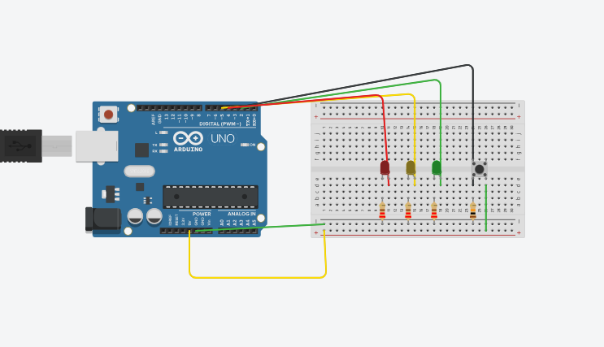
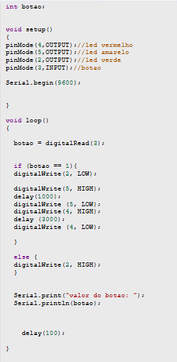

Nome: Pedro Santos  
    Adrian Eusébio  
    Marley Teixeira

## Componentes:

+ 1 Arduino Uno  
+ 3 LEDs (vermelho, amarelo e verde)  
+ 3 resistores de 220Ω  
+ 1 botão  
+ 1 resistor de 10kΩ   
+ Fios jumper  
+ 1 protoboard  

  

## Circuito:  
+ Led verde – porta 2
+ Led amarelo – porta 5
+ Led vermelho – porta 4
+ Botão – porta 3  
 
Começamos ligando os jumpers da porta GND para o negativo da protoboard, e a porta 5v no positivo. Ligamos as portas no lado positivo do led, e colocamos resistores no lado negativo dos leds para diminuir a carga elétrica. Conectamos o negativo em um dos lados do botão junto com um jumper puxando da porta serial, e depois outro jumper do positivo da protoboard, que está ligado na porta 5v.

  

  

## Código:  
Começamos definindo a variável “botao” para receber o estado atual do botão. No void setup, definimos as entradas e saídas, os leds são saídas (OUTPUT) e o botão é entrada (INPUT). No void loop a variável “botao” está recebendo a leitura da porta 3, que é o estado do botão, se está pressionado (1), ou não está pressionado (0). No comando “if” quando o botão é pressionado o led verde que está acesso, será apagado e acenderá o led amarelo por 1 segundo, e apagará logo em seguida ascendendo o led vermelho por 3 segundos.

 