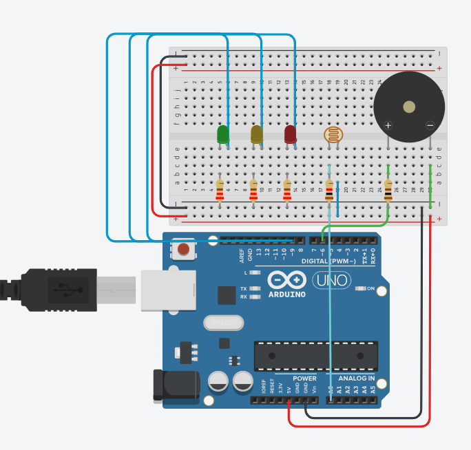

Nome: Pedro Santos  
Guilherme Niza  
Derick Prado  
João Andrade  

## Introdução  

Desde os primórdios da civilização, a humanidade tende a cultivar plantas tantos para fins alimentares quanto para fins ornamentais. Atualmente as plantas ornamentais são requisitadas em jardins, tanto externos quanto internos, além de áreas verdes em ambientes diversos, sejam particulares ou públicos. Certas plantas ornamentais não suportam alta luminosidade, e por isso precisam de um ambiente com luminosidade controlada para crescer saudáveis.  

## Projeto  

O projeto consiste em criar um sistema de controle de luminosidade para plantas ornamentais, utilizando sensores de luminosidade e um sistema de controle de telas. O sistema deve ser capaz de detectar a luminosidade ambiente e ajustar as telas para manter a luminosidade dentro de um intervalo adequado para as plantas.  

  

  

  

## referências  

+ Ezequiel Barth Arend. Produção de Plantas Ornamentais. 2019  
http://hdl.handle.net/10183/199597

+ André Brugnara Soares.  Influência da luminosidade no comportamento de onze espécies forrageiras perenes de verão. 2009  
https://doi.org/10.1590/S1516-35982009000300007

+  Maria Simone de Castro Pereira Brainer. Flores e Plantas Ornamentais. 2019 
http://s2dspg01.dreads.bnb:8080/s482-dspace/handle/123456789/205
